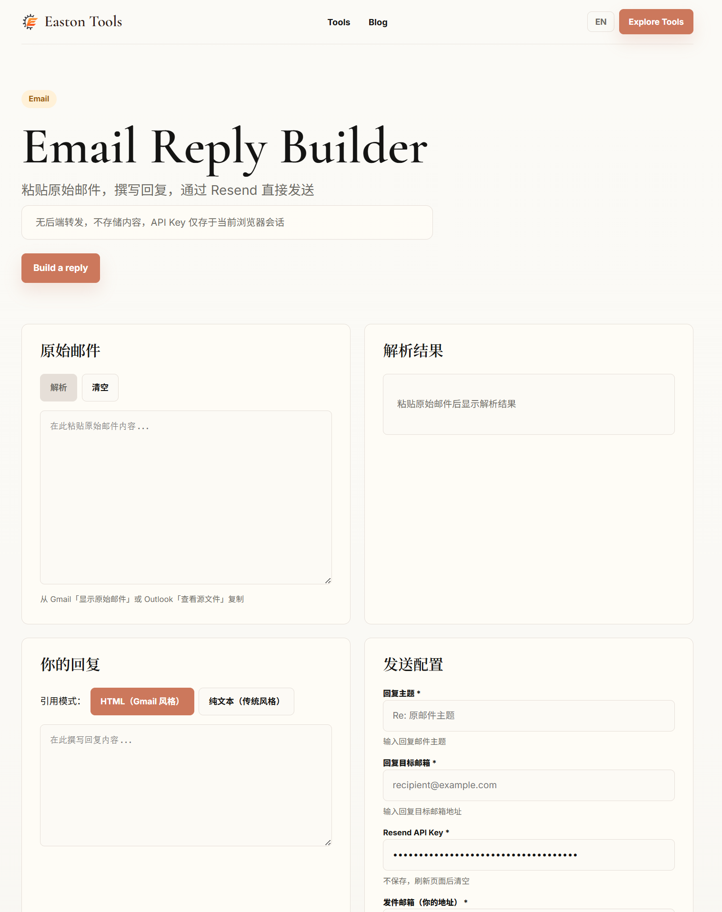

# Email Reply Builder

Email Reply Builder 是一个自定义域名邮箱回复工具，帮助你用自己的域名邮箱回复邮件，同时保留原始邮件线程和 Gmail 对话历史。

它特别适合这样的场景：你用 Cloudflare Email Routing 接收 `contact@yourdomain.com`、`support@yourdomain.com` 之类的自定义域名邮箱，把邮件转发到 Gmail 等个人邮箱；但回复时，你希望仍然从同一个自定义邮箱地址发出，并且不丢失原邮件中的历史记录和会话线程。

这是 Easton Tools 中 Email Reply Builder 的开源版本。

- 在线工具：[Email Reply Builder](https://tools.eastondev.com/email-reply-builder/)
- 更多工具：[Easton Tools](https://tools.eastondev.com/)
- 博客和构建笔记：[Easton Dev Blog](https://eastondev.com)
- English documentation: [README.md](./README.md)



## 为什么需要这个工具

Cloudflare Email Routing 很适合用来自定义域名邮箱收信，但“从同一个自定义邮箱地址回复”会比较麻烦。常见流程是：

```text
contact@yourdomain.com -> Cloudflare Email Routing -> 你的 Gmail 收件箱
```

收信很顺畅，问题出现在回复时。如果你直接从 Gmail 回复，发件地址可能变成 Gmail 地址；如果你用 Resend 发送回复，Gmail 等邮件客户端又可能把它显示成一封新的独立邮件，而不是原对话里的回复。

Email Reply Builder 解决的就是这个小但很烦的痛点：它解析原始邮件，提取 `Message-ID`、`In-Reply-To`、`References` 等线程头，然后构建带有正确线程头的 Resend 邮件，让回复尽量保留在同一个邮件会话中。

## 适用场景

- 使用 Cloudflare Email Routing 后，从自定义域名邮箱回复邮件。
- 通过 Resend 回复邮件时，保留 Gmail conversation history。
- 用 `contact@yourdomain.com`、`support@yourdomain.com` 等地址发送同线程回复。
- 从原始邮件中提取 `Message-ID`、`In-Reply-To` 和 `References`。
- 不配置完整邮箱服务商，也能搭建轻量级 custom domain email reply workflow。

## 功能特性

- **原始邮件解析** - 提取发件人、收件人、主题、日期、`Message-ID`、`In-Reply-To` 和 `References`。
- **同线程 Resend 回复** - 生成 Gmail 等客户端用于归并会话的邮件头。
- **自定义域名邮箱工作流** - 面向 Cloudflare Email Routing + Gmail + Resend 的使用方式。
- **UTF-8 安全解码** - 支持按 charset 解码 Base64 和 quoted-printable 内容。
- **本地附件** - 支持本地文件附件，Base64 编码，合计约 9 MB 上限。
- **中英文界面** - 内置英文和中文界面文案。

## 快速开始

需要 Node.js 22.12.0 或更高版本。

```bash
git clone https://github.com/EastonSu/email-reply-builder.git
cd email-reply-builder
npm install
npm run dev
```

打开 Astro 输出的本地地址，通常是 `http://localhost:4321`。

## 工作流程

1. 通过 Cloudflare Email Routing 在 Gmail 或其他邮箱中收到邮件。
2. 在 Gmail 中打开原邮件，选择 **显示原始邮件**。
3. 复制完整原始邮件内容。
4. 粘贴到 Email Reply Builder 并解析。
5. 撰写回复，确认发件地址，并输入 Resend API Key。
6. 通过 Resend 发送带有正确线程头的回复。

本地运行时，浏览器会调用本机 Astro 接口：

```text
Browser -> http://localhost:4321/api/send -> Resend API
```

Resend API Key 只会为了请求 Resend 而发送到本地 `/api/send`。不要提交真实 `.env`，也不要在生产构建中使用公开的 `PUBLIC_RESEND_API_KEY`。

### 可选：本地预填 API Key

可以复制 `.env.example` 为 `.env`，然后设置：

```bash
PUBLIC_RESEND_API_KEY=re_xxx
```

这只建议本地开发使用。Vite 会把 `PUBLIC_` 变量暴露到浏览器 JavaScript 中，因此该值可能出现在前端 bundle 里。

## 常用脚本

```bash
npm run dev       # 启动本地开发服务
npm test -- --run # 运行一次单元测试
npm run build     # 构建服务端和客户端产物
npm run preview   # 预览生产构建
```

## 部署

项目使用 Astro server output，因为 `/api/send` 需要代理请求 Resend。可以部署到支持 Node 运行时的平台，例如 Vercel、带 Node runtime 的 Netlify，或自建 Node 服务。

如果公开部署，请先为 API 路由补充适合你部署环境的限流、请求体大小限制、超时处理和日志规则。

## 项目结构

```text
src/
  pages/          Astro 页面和 API 路由
  components/     React UI 组件
  lib/parser/     原始邮件解析
  lib/quoting/    回复引用块生成
  lib/send/       Resend payload 和附件工具
  lib/validation/ 客户端校验
  styles/         应用样式
```

## 隐私说明

- 原始邮件解析发生在浏览器中。
- API Key 保存在 React state 中，不写入 `localStorage`。
- 点击发送时，API Key 和邮件 payload 会发送到当前运行实例的 `/api/send`，由它请求 Resend。
- Easton Tools 官方托管版本不会存储你的 API Key 或邮件内容。

安全报告和密钥处理建议见 [SECURITY.md](./SECURITY.md)。

## 贡献

欢迎提交 Issue 和 Pull Request。详见 [CONTRIBUTING.md](./CONTRIBUTING.md)。

## 许可证

MIT License。详见 [LICENSE](./LICENSE)。
